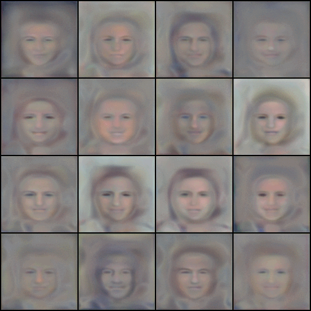

# CelebaGAN-Playground

CelebaGAN-Playground is an experimental environment for training and exploring GAN architectures (DCGAN, WGAN, StyleGAN, etc.) on the [CelebA dataset](http://mmlab.ie.cuhk.edu.hk/projects/CelebA.html).
The goal of this repository is to provide a simple playground for experimenting with different training setups, visualizing results, and understanding the dynamics of GAN training.

## 📸 Example Training Progress

